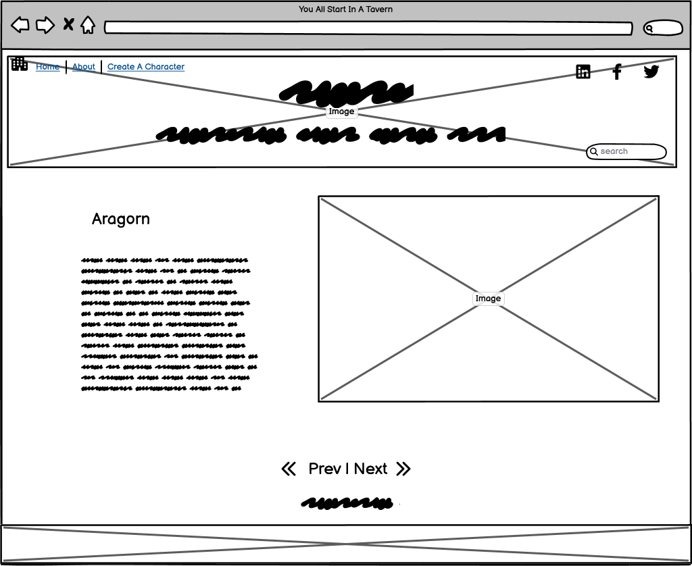
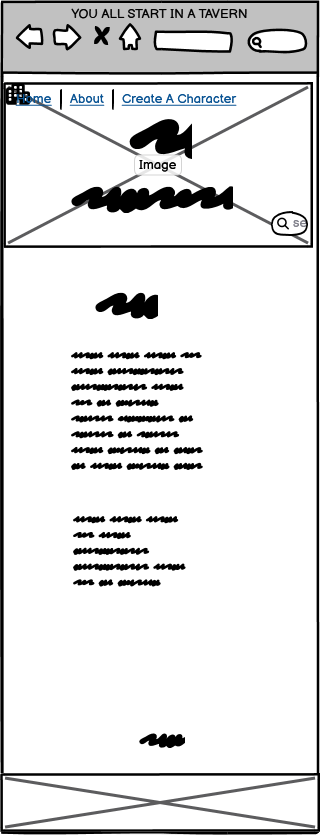
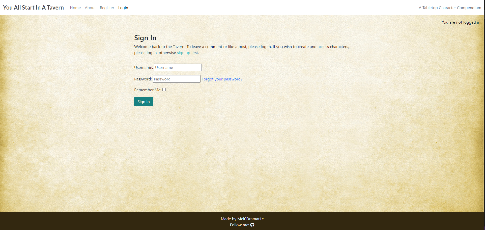

# [YOU ALL START IN A TAVERN](https://you-all-start-in-a-tavern-91f97ae29726.herokuapp.com)

[](https://github.com/Mel0Dramat1c/You-All-Start-In-A-Tavern/commits/main)
[](https://github.com/Mel0Dramat1c/You-All-Start-In-A-Tavern/commits/main)
[](https://github.com/Mel0Dramat1c/You-All-Start-In-A-Tavern)

## YOUR ADVENTURE AWAITS!

You All Start In A Tavern is a website for the creation and storage of character sheets in tabletop RPGs such as 'Dungeons and Dragons' or 'Pathfinder'. It features CRUD functionality and responsive design to allow users to easily create, edit, and delete character sheets for use in campaigns with friends and quick reference for dungeon masters, other players, or for sharing examples of character builds online.

The website aims first and foremost to be easy to use, with dropdown menus for fixed classes and races, and text areas for items and features to allow for custom rules and easy on-the-fly edits for house rules, retcons, or just simplifying official rules text for readability, without needing to create a new character sheet everytime.

You All Start In A Tavern is useful to new and veteran players alike. It informs beginners as to what fields in their character sheet are the most important by virtue of having them be mandatory includes while veteran players will benefit from having quick access to any of their many characters without having to store and maintain sheets and sheets of printed paper.

Even for old school traditionalists who prefer the comforting feel of pen and paper, You All Start In A Tavern is an invaluable back up should a paper character sheet be damaged, lost, or just forgotten in the car, allowing the user to simply transfer all their most important stored info to a new or temporary paper sheet in a pinch. The call to adventure should not be hindered by spilt coffee or rushing out the door!

---

Resposiveness was tested using AmIResponsive website:
https://ui.dev/amiresponsive?url=https://you-all-start-in-a-tavern-91f97ae29726.herokuapp.com


## UX

The purpose of this website is to provide quick access to character sheets across a variety of devices so ease of use and visibility was the top priority. This is why I prioritised access to characters on the main page as well as bold colours and simple columns and rows for their listing. As the website is made for fantasy tabletop roleplaying games, I wanted a rustic, adventurous aesthetic, hence the use of the scroll background. The idea is to give the feeling of opening an old book that keeps record of a famous adventurer like something from a storybook or fantasy archive.

### Colour Scheme

The following colours were used to create a clear and readable website while maintaining the theme of fantasy adventure.

- `#4A4A4F` used for primary text.
- `#188181` used for primary highlights.
- `#ffffff` used for navbar.
- `#000000` used for secondary text.

I used [coolors.co](https://coolors.co/4a4a4f-332810-ffffff-188181-000000) to generate my colour palette.


### Typography

- [Lato](https://fonts.google.com/specimen/Lato) was used for the primary headers and titles.

- [Sans Serrif](https://fonts.google.com/specimen/SansSerrif) was used for all other secondary text.

- [Font Awesome](https://fontawesome.com) for fonts and the social media icon in the footer.

## User Stories

### New Site Users

- As a new site user, I would like to easily create my own account, so that I can use the website.
- As a new site user, I would like to immediately understand the purpose of the website, so that I can see if it's right for me.
- As a new site user, I would like to create my own character, so that I can use the website as a reference in my games.
- As a new site user, I would like to be able to easily navigate the website, so that I am not confused or overwhelmed.
- As a new site user, I would like to be able to see examples of created characters, so that I know what it will look like.

### Returning Site Users

- As a returning site user, I would like to  be able to sign in and out of my account.
- As a returning site user, I would like my characters to be stored, so that I can reference them in the future.
- As a returning site user, I would like to be able to edit my character, so that I can keep them up to date.
- As a returning site user, I would like to delete characters that I no longer use.
- As a returning site user, I would like to I would like to know what future features the website will have.

### Site Admin

- As a site administrator, I should be able to see profiles and characters made on the site.
- As a site administrator, I should be able to delete character and profiles, so that I can better maintain the site.
- As a site administrator, I should be able to ban bad acting users, so that I can keep the website friendly and welcoming.
- As a site administrator, I should be able to easily manage the site, so that I can be confident in its quality.
- As a site administrator, I should be able to keep the site secure, so that I can prevent character sheet sabotage.

## Wireframes

To follow best practice, wireframes were developed for mobile, tablet, and desktop sizes.
I've used [Balsamiq](https://balsamiq.com/wireframes) to design my site wireframes.

### Desktop Wireframes

<details>
<summary> Click here to see the Desktop Wireframes </summary>

Home
  - 

About
  - 

Character
  - 
</details>

### Mobile Wireframes

<details>
<summary> Click here to see the Mobile Wireframes </summary>

Home
  - 

About
  - 

Character
  - 

etc.
  - repeat for any remaining mobile wireframes

</details>

### Tablet Wireframes

<details>
<summary> Click here to see the Tablet Wireframes </summary>

Home
  - 

About
  - 

Create A Character
  - 

</details>

## Features

### Existing Features

- **THE TAVERN**

    -  The main page of the website that features created characters for users to view. The page hosts pages of the most recently created characters as well as the navbar that allows easy navigation to any part of the website.


- **CREATE A CHARACTER**

    - The character creator that allows users to fill in fields to create a custom character using the 'character' model. The page features an easy to use form that contains multiple named fields.


- **CHARACTER**

    - The created character pages that features its creator's charactor. These are found on the main page and contain a styled, easy to read character sheet of all the relevant characters stats chosen during the character creation phase. These characters can be edited or deleted by their respective user.


- **LOGIN/LOGOUT**

    - The login and logout pages are easy to use and ensure that users have exclusive access to edit or delete their characters. They allow for saved passwords and have a remember me option for quick signing in to the website. 




### Future Features

- Search Bar
    - A search feature to allow users to search for characters by name, class, or user.
- User Characters
    - A feature to limit the displayed characters to ones only created by the logged in user for quick access.
- Profile customisation
    - A feature to allow personal customisation of the logged in users profile, including profile picture, and the ability to quickly edit username.
- Ability Score Modifiers
    - A feature to automatically determine ability score modifiers for gameplay by converting listed character statistics into the respective bonuses they apply, e.g. Having 14 Strength grants a +2 modifier for Strength checks.
- Default Traits
    - A feature to automatically provide default class or race features provided by the chosen character class or race, e.g. Elves having Darkvision or Barbarians having Rage.
- Character Portraits
    - A feature to allow users to upload a picture of their character to their character sheet rather than the default placeholder.
  

## Tools & Technologies Used

- [](https://git-scm.com) used for version control. (`git add`, `git commit`, `git push`)

- [](https://github.com) used for secure online code storage.

- [](https://gitpod.io) used as a cloud-based IDE for development.

- [](https://en.wikipedia.org/wiki/HTML) used for the main site content.

- [](https://en.wikipedia.org/wiki/CSS) used for the main site design and layout.

- [](https://www.javascript.com) used for user interaction on the site.

- [](https://www.python.org) used as the back-end programming language.

- [](https://pages.github.com) used for hosting the deployed front-end site.

- [](https://www.heroku.com) used for hosting the deployed back-end site.

- [](https://getbootstrap.com) used as the front-end CSS framework for modern responsiveness and pre-built components.

- [](https://www.djangoproject.com) used as the Python framework for the site.

- [](https://www.postgresql.org) used as the relational database management.

- [](https://www.elephantsql.com) used as the Postgres database.

- [](https://cloudinary.com) used for online static file storage.

- [](https://whitenoise.readthedocs.io) used for serving static files with Heroku.

- [](https://balsamiq.com/wireframes) used for creating wireframes.

## Database Design

Entity Relationship Diagrams (ERD) help to visualize database architecture before creating models.
Understanding the relationships between different tables can save time later in the project.

## Models

```python
class CharacterClass(models.Model):
    name = models.CharField(max_length=25, null=False, blank=False)

    def __str__(self):
        return self.name


class CharacterRace(models.Model):
    name = models.CharField(max_length=25, null=False, blank=False)

    def __str__(self):
        return self.name


class Character(models.Model):
    profile = models.ForeignKey(Profile, on_delete=models.CASCADE)

    name = models.CharField(max_length=100, null=False, blank=False)
    character_class = models.ForeignKey(
        CharacterClass, on_delete=models.CASCADE, null=False, blank=False)
    character_race = models.ForeignKey(
        CharacterRace, on_delete=models.CASCADE, null=True, blank=True)
    level = models.PositiveIntegerField(
        default=1,
        validators=[MinValueValidator(1), MaxValueValidator(20)],
        null=False, blank=False
    )
    strength = models.PositiveIntegerField(
        default=1,
        validators=[MinValueValidator(1), MaxValueValidator(50)],
        null=False, blank=False
    )
    dexterity = models.PositiveIntegerField(
        default=1,
        validators=[MinValueValidator(1), MaxValueValidator(50)],
        null=False, blank=False
    )
    constitution = models.PositiveIntegerField(
        default=1,
        validators=[MinValueValidator(1), MaxValueValidator(50)],
        null=False, blank=False
    )
    intelligence = models.PositiveIntegerField(
        default=1,
        validators=[MinValueValidator(1), MaxValueValidator(50)],
        null=False, blank=False
    )
    wisdom = models.PositiveIntegerField(
        default=1,
        validators=[MinValueValidator(1), MaxValueValidator(50)],
        null=False, blank=False
    )
    charisma = models.PositiveIntegerField(
        default=1,
        validators=[MinValueValidator(1), MaxValueValidator(50)],
        null=False, blank=False
    )
    items = models.TextField(null=True, blank=True)
    features = models.TextField(null=True, blank=True)
    bio = models.TextField(null=True, blank=True)
    created_on = models.DateTimeField(auto_now_add=True)

    def __str__(self):
        return self.name


class Profile(models.Model):
    """
    Model for user's profile (extending from the default User model).
    """
    user = models.OneToOneField(User, on_delete=models.CASCADE)
    image = CloudinaryField("image", default="placeholder")

    def image_preview(self):
        from django.utils.html import format_html
        return format_html(f"")

    def __str__(self):
        return self.user.username
```

I have used `pygraphviz` and `django-extensions` to auto-generate an ERD.

The steps taken were as follows:
- In the terminal: `sudo apt update`
- then: `sudo apt-get install python3-dev graphviz libgraphviz-dev pkg-config`
- then type `Y` to proceed
- then: `pip3 install django-extensions pygraphviz`
- in my `settings.py` file, I added the following to my `INSTALLED_APPS`:

```python
INSTALLED_APPS = [
    ...
    'django_extensions',
    ...
]
```
- back in the terminal: `python3 manage.py graph_models -a -o erd.png`
- dragged the new `erd.png` file into my `documentation/` folder
- removed `'django_extensions',` from my `INSTALLED_APPS`
- finally, in the terminal: `pip3 uninstall django-extensions pygraphviz -y`


source: [medium.com](https://medium.com/@yathomasi1/1-using-django-extensions-to-visualize-the-database-diagram-in-django-application-c5fa7e710e16)


## Agile Development Process

### GitHub Projects

[GitHub Projects](https://github.com/Mel0Dramat1c/You-All-Start-In-A-Tavern/projects) served as an Agile tool for this project.
It isn't a specialized tool, but with the right tags and project creation/issue assignments, it can be made to work.

Through it, user stories, issues, and milestone tasks were planned, then tracked on a weekly basis using the basic Kanban board.


### GitHub Issues

[GitHub Issues](https://github.com/Mel0Dramat1c/You-All-Start-In-A-Tavern/issues) served as an another Agile tool.
There, I used my own **User Story Template** to manage user stories.

It also helped with milestone iterations on a weekly basis.

- [Open Issues](https://github.com/Mel0Dramat1c/You-All-Start-In-A-Tavern/issues) [](https://github.com/Mel0Dramat1c/You-All-Start-In-A-Tavern/issues)

    

- [Closed Issues](https://github.com/Mel0Dramat1c/You-All-Start-In-A-Tavern/issues?q=is%3Aissue+is%3Aclosed) [](https://github.com/Mel0Dramat1c/You-All-Start-In-A-Tavern/issues?q=is%3Aissue+is%3Aclosed)

    

### MoSCoW Prioritization

I've decomposed my Epics into stories prior to prioritizing and implementing them.
Using this approach, I was able to apply the MoSCow prioritization and labels to my user stories within the Issues tab.

- **Must Have**: guaranteed to be delivered (*max 60% of stories*)
- **Should Have**: adds significant value, but not vital (*the rest ~20% of stories*)
- **Could Have**: has small impact if left out (*20% of stories*)
- **Won't Have**: not a priority for this iteration

## Testing

> [!NOTE]  
> For all testing, please refer to the [TESTING.md](TESTING.md) file.

## Deployment

The live deployed application can be found deployed on [Heroku](https://you-all-start-in-a-tavern-91f97ae29726.herokuapp.com).

### PostgreSQL Database

This project uses a [Code Institute PostgreSQL Database](https://dbs.ci-dbs.net).

To obtain my own Postgres Database from Code Institute, I followed these steps:

- Signed-in to the CI LMS using my email address.
- An email was sent to me with my new Postgres Database.

> [!CAUTION]  
> - PostgreSQL databases by Code Institute are only available to CI Students.
> - You must acquire your own PostgreSQL database through some other method if you plan to clone/fork this repository.
> - Code Institute students are allowed a maximum of 8 databases.
> - Databases are subject to deletion after 18 months.

### Cloudinary API

This project uses the [Cloudinary API](https://cloudinary.com) to store media assets online, due to the fact that Heroku doesn't persist this type of data.

To obtain your own Cloudinary API key, create an account and log in.

- For *Primary interest*, you can choose *Programmable Media for image and video API*.
- Optional: *edit your assigned cloud name to something more memorable*.
- On your Cloudinary Dashboard, you can copy your **API Environment Variable**.
- Be sure to remove the `CLOUDINARY_URL=` as part of the API **value**; this is the **key**.

### Heroku Deployment

This project uses [Heroku](https://www.heroku.com), a platform as a service (PaaS) that enables developers to build, run, and operate applications entirely in the cloud.

Deployment steps are as follows, after account setup:

- Select **New** in the top-right corner of your Heroku Dashboard, and select **Create new app** from the dropdown menu.
- Your app name must be unique, and then choose a region closest to you (EU or USA), and finally, select **Create App**.
- From the new app **Settings**, click **Reveal Config Vars**, and set your environment variables.

> [!IMPORTANT]  
> This is a sample only; you would replace the values with your own if cloning/forking my repository.

| Key | Value |
| --- | --- |
| `CLOUDINARY_URL` | user's own value |
| `DATABASE_URL` | user's own value |
| `DISABLE_COLLECTSTATIC` | 1 (*this is temporary, and can be removed for the final deployment*) |
| `SECRET_KEY` | user's own value |

Heroku needs three additional files in order to deploy properly.

- requirements.txt
- Procfile
- runtime.txt

You can install this project's **requirements** (where applicable) using:

- `pip3 install -r requirements.txt`

If you have your own packages that have been installed, then the requirements file needs updated using:

- `pip3 freeze --local > requirements.txt`

The **Procfile** can be created with the following command:

- `echo web: gunicorn you_all_start_in_a_tavern.wsgi > Procfile`
- *replace **app_name** with the name of your primary Django app name; the folder where settings.py is located*

The **runtime.txt** file needs to know which Python version you're using:
1. type: `python3 --version` in the terminal.
2. in the **runtime.txt** file, add your Python version:
	- `python-3.9.18`

For Heroku deployment, follow these steps to connect your own GitHub repository to the newly created app:

Either:

- Select **Automatic Deployment** from the Heroku app.

Or:

- In the Terminal/CLI, connect to Heroku using this command: `heroku login -i`
- Set the remote for Heroku: `heroku git:remote -a app_name` (replace *app_name* with your app name)
- After performing the standard Git `add`, `commit`, and `push` to GitHub, you can now type:
	- `git push heroku main`

The project should now be connected and deployed to Heroku!

### Local Deployment

This project can be cloned or forked in order to make a local copy on your own system.

For either method, you will need to install any applicable packages found within the *requirements.txt* file.

- `pip3 install -r requirements.txt`.

You will need to create a new file called `env.py` at the root-level,
and include the same environment variables listed above from the Heroku deployment steps.

> [!IMPORTANT]  
> This is a sample only; you would replace the values with your own if cloning/forking my repository.

Sample `env.py` file:

```python
import os

os.environ.setdefault("CLOUDINARY_URL", "user's own value")
os.environ.setdefault("DATABASE_URL", "user's own value")
os.environ.setdefault("SECRET_KEY", "user's own value")

# local environment only (do not include these in production/deployment!)
os.environ.setdefault("DEBUG", "True")
```

Once the project is cloned or forked, in order to run it locally, you'll need to follow these steps:

- Start the Django app: `python3 manage.py runserver`
- Stop the app once it's loaded: `CTRL+C` or `⌘+C` (Mac)
- Make any necessary migrations: `python3 manage.py makemigrations`
- Migrate the data to the database: `python3 manage.py migrate`
- Create a superuser: `python3 manage.py createsuperuser`
- Load fixtures (if applicable): `python3 manage.py loaddata file-name.json` (repeat for each file)
- Everything should be ready now, so run the Django app again: `python3 manage.py runserver`

#### Cloning

You can clone the repository by following these steps:

1. Go to the [GitHub repository](https://github.com/Mel0Dramat1c/You-All-Start-In-A-Tavern) 
2. Locate the Code button above the list of files and click it 
3. Select if you prefer to clone using HTTPS, SSH, or GitHub CLI and click the copy button to copy the URL to your clipboard
4. Open Git Bash or Terminal
5. Change the current working directory to the one where you want the cloned directory
6. In your IDE Terminal, type the following command to clone my repository:
	- `git clone https://github.com/Mel0Dramat1c/You-All-Start-In-A-Tavern.git`
7. Press Enter to create your local clone.

Alternatively, if using Gitpod, you can click below to create your own workspace using this repository.

[](https://gitpod.io/#https://github.com/Mel0Dramat1c/You-All-Start-In-A-Tavern)

Please note that in order to directly open the project in Gitpod, you need to have the browser extension installed.
A tutorial on how to do that can be found [here](https://www.gitpod.io/docs/configure/user-settings/browser-extension).

#### Forking

By forking the GitHub Repository, we make a copy of the original repository on our GitHub account to view and/or make changes without affecting the original owner's repository.
You can fork this repository by using the following steps:

1. Log in to GitHub and locate the [GitHub Repository](https://github.com/Mel0Dramat1c/You-All-Start-In-A-Tavern)
2. At the top of the Repository (not top of page) just above the "Settings" Button on the menu, locate the "Fork" Button.
3. Once clicked, you should now have a copy of the original repository in your own GitHub account!

### Local VS Deployment

There were no thankfully no differences between the Heroku deployment and the locally deployed version of the website. Heroku was able to successfully deploy the website with the only difference being the debugging available through the local version.

## Credits

Images for this website were generated by DeepAI.org

The background for the website was sourced from Master Art Studio.

Templates and structure were built upon Code Intitute's Code|Star blog tutorial by Matt Rudge.
Code for the character model was built on the amazing work of Tim Nelson who provided the base iteration.
Edit and delete features were also assisted by Tim Nelson to incorporate full CRUD functionality.

In this section you need to reference where you got your content, media, and extra help from.
It is common practice to use code from other repositories and tutorials,
however, it is important to be very specific about these sources to avoid plagiarism.

### Content

| Source | Location | Notes |
| --- | --- | --- |
| [Markdown Builder](https://tim.2bn.dev/markdown-builder) | README and TESTING | tool to help generate the Markdown files |
| [W3Schools](https://www.w3schools.com/howto/howto_js_topnav_responsive.asp) | entire site | responsive HTML/CSS/JS navbar |
| [W3Schools](https://www.w3schools.com/css/css3_variables.asp) | entire site | how to use CSS :root variables |
| [WhiteNoise](http://whitenoise.evans.io) | entire site | hosting static files on Heroku temporarily |
| [ChatGPT](https://chat.openai.com) | entire site | assistance with debugging | 

### Media

| Source | Location | Type | Notes |
| --- | --- | --- | --- |
| [DeepAi](https://deepai.org/machine-learning-model/text2img) | entire site | images |
| [MasterArtStudio](https://www.masterartstudio.com/antique-scroll-backgrounds-jpg/) | antique scroll backgrounds | main page background |
| [Flaticon](https://www.flaticon.com/free-icon/fantasy_7520395) | free icon | favicon |

### Acknowledgements

- I would like to thank my Code Institute mentor, [Tim Nelson](https://github.com/TravelTimN) for his support throughout the development of this project and for equiping me with the tools to best use Django. Without his guidance, this project would not be half of what it is.
- I would like to thank the [Code Institute](https://codeinstitute.net) tutor team for their assistance with troubleshooting and debugging issues.
- I would like to thank the [Code Institute Slack community](https://code-institute-room.slack.com) for the moral support; it kept me going during periods of self doubt and imposter syndrome.
- I would like to thank my partner Mervyn, for believing in me, providing support throughout this whole journey, and encouraging me to make this transition into software development.
- I would like to thank my facilitator [David Calikes](https://github.com/davidcalikes) for his amazing patience, kindness, and candour across four months of meetings, projects, and behavioural sessions.

