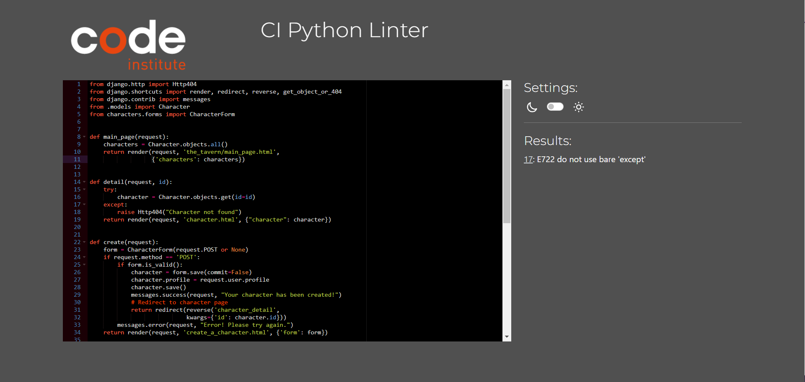

# Testing

> [!NOTE]  
> Return back to the [README.md](README.md) file.

## Code Validation

### HTML

I have used the recommended [HTML W3C Validator](https://validator.w3.org) to validate all of my HTML files.

| Directory | File | Screenshot | Notes |
| --- | --- | --- | --- |
| about | about.html |  | |
| characters | character.html |  | |
| characters | create_a_character.html |  | |
| characters | edit_a_character.html |  | |
| the_tavern | main_page.html |  | |

### CSS

I have used the recommended [CSS Jigsaw Validator](https://jigsaw.w3.org/css-validator) to validate all of my CSS files.

| Directory | File | Screenshot | Notes |
| --- | --- | --- | --- |
| static | style.css |  | |

### JavaScript

I have used the recommended [JShint Validator](https://jshint.com) to validate all of my JS files.

| Directory | File | Screenshot | Notes |
| --- | --- | --- | --- |
| static | script.js |  | |

### Python

I have used the recommended [PEP8 CI Python Linter](https://pep8ci.herokuapp.com) to validate all of my Python files.

| Directory | File | CI URL | Screenshot | Notes |
| --- | --- | --- | --- | --- |
| about | admin.py | [PEP8 CI](https://pep8ci.herokuapp.com/https://raw.githubusercontent.com/Mel0Dramat1c/You-All-Start-In-A-Tavern/main/about/admin.py) |  | |
| about | models.py | [PEP8 CI](https://pep8ci.herokuapp.com/https://raw.githubusercontent.com/Mel0Dramat1c/You-All-Start-In-A-Tavern/main/about/models.py) |  | |
| about | urls.py | [PEP8 CI](https://pep8ci.herokuapp.com/https://raw.githubusercontent.com/Mel0Dramat1c/You-All-Start-In-A-Tavern/main/about/urls.py) |  | |
| about | views.py | [PEP8 CI](https://pep8ci.herokuapp.com/https://raw.githubusercontent.com/Mel0Dramat1c/You-All-Start-In-A-Tavern/main/about/views.py) |  | |
| characters | admin.py | [PEP8 CI](https://pep8ci.herokuapp.com/https://raw.githubusercontent.com/Mel0Dramat1c/You-All-Start-In-A-Tavern/main/characters/admin.py) |  | |
| characters | forms.py | [PEP8 CI](https://pep8ci.herokuapp.com/https://raw.githubusercontent.com/Mel0Dramat1c/You-All-Start-In-A-Tavern/main/characters/forms.py) |  | |
| characters | models.py | [PEP8 CI](https://pep8ci.herokuapp.com/https://raw.githubusercontent.com/Mel0Dramat1c/You-All-Start-In-A-Tavern/main/characters/models.py) |  | |
| characters | urls.py | [PEP8 CI](https://pep8ci.herokuapp.com/https://raw.githubusercontent.com/Mel0Dramat1c/You-All-Start-In-A-Tavern/main/characters/urls.py) |  | |
| characters | views.py | [PEP8 CI](https://pep8ci.herokuapp.com/https://raw.githubusercontent.com/Mel0Dramat1c/You-All-Start-In-A-Tavern/main/characters/views.py) |  | |
|  | manage.py | [PEP8 CI](https://pep8ci.herokuapp.com/https://raw.githubusercontent.com/Mel0Dramat1c/You-All-Start-In-A-Tavern/main/manage.py) |  | Raise is included on following line |
| profiles | admin.py | [PEP8 CI](https://pep8ci.herokuapp.com/https://raw.githubusercontent.com/Mel0Dramat1c/You-All-Start-In-A-Tavern/main/profiles/admin.py) |  | |
| profiles | models.py | [PEP8 CI](https://pep8ci.herokuapp.com/https://raw.githubusercontent.com/Mel0Dramat1c/You-All-Start-In-A-Tavern/main/profiles/models.py) |  | |
| profiles | signals.py | [PEP8 CI](https://pep8ci.herokuapp.com/https://raw.githubusercontent.com/Mel0Dramat1c/You-All-Start-In-A-Tavern/main/profiles/signals.py) |  | |
| profiles | urls.py | [PEP8 CI](https://pep8ci.herokuapp.com/https://raw.githubusercontent.com/Mel0Dramat1c/You-All-Start-In-A-Tavern/main/profiles/urls.py) |  | |
| profiles | views.py | [PEP8 CI](https://pep8ci.herokuapp.com/https://raw.githubusercontent.com/Mel0Dramat1c/You-All-Start-In-A-Tavern/main/profiles/views.py) |  | |
| the_tavern | admin.py | [PEP8 CI](https://pep8ci.herokuapp.com/https://raw.githubusercontent.com/Mel0Dramat1c/You-All-Start-In-A-Tavern/main/the_tavern/admin.py) |  | |
| the_tavern | models.py | [PEP8 CI](https://pep8ci.herokuapp.com/https://raw.githubusercontent.com/Mel0Dramat1c/You-All-Start-In-A-Tavern/main/the_tavern/models.py) |  | |
| the_tavern | urls.py | [PEP8 CI](https://pep8ci.herokuapp.com/https://raw.githubusercontent.com/Mel0Dramat1c/You-All-Start-In-A-Tavern/main/the_tavern/urls.py) |  | |
| the_tavern | apps.py | [PEP8 CI](https://pep8ci.herokuapp.com/https://raw.githubusercontent.com/Mel0Dramat1c/You-All-Start-In-A-Tavern/main/the_tavern/apps.py) |  | |
| the_tavern | views.py | [PEP8 CI](https://pep8ci.herokuapp.com/https://raw.githubusercontent.com/Mel0Dramat1c/You-All-Start-In-A-Tavern/main/the_tavern/views.py) |  | |
| you_all_start_in_a_tavern | settings.py | [PEP8 CI](https://pep8ci.herokuapp.com/https://raw.githubusercontent.com/Mel0Dramat1c/You-All-Start-In-A-Tavern/main/you_all_start_in_a_tavern/settings.py) |  | Line 128 longer than standard but necessary |
| you_all_start_in_a_tavern | urls.py | [PEP8 CI](https://pep8ci.herokuapp.com/https://raw.githubusercontent.com/Mel0Dramat1c/You-All-Start-In-A-Tavern/main/you_all_start_in_a_tavern/urls.py) |  | |

## Browser Compatibility

I've tested my deployed project on multiple browsers to check for compatibility issues.

| Browser | Home | About | Contact | etc | Notes |
| --- | --- | --- | --- | --- | --- |
| Chrome |  |  |  |  | |  | Works as expected |
| Firefox |  |  |  |  | |  | Works as expected |
| Edge |  |  |  |  | |  | Works as expected |

## Responsiveness

Responsivity was tested across multiple devices using DevTools to ensure no issues.

| Device | Home | About | Contact | etc | Notes |
| --- | --- | --- | --- | --- | --- |
| Mobile |  |  |  |  | Scaling starts to have minor issues for character creator |
| Tablet |  |  |  |  | Works as expected |
| Laptop |  |  |  |  | Works as expected |
| Desktop |  |  |  |  | Works as expected |

## Lighthouse Audit

I've tested my deployed project using the Lighthouse Audit tool to check for any major issues.

| Page | Mobile | Desktop | Notes |
| --- | --- | --- | --- |
| Home |  |  | Some minor warnings |
| About |  |  | Some minor warnings |
| Create A Character |  |  | Some minor warnings |
| Character |  |  | Slow response time due to images |

## Defensive Programming

| Page | User Action | Expected Result | Pass/Fail | Comments |
| --- | --- | --- | --- | --- |
| Home | | | | |
| | Click on Logo | Redirection to Home page | Pass | |
| | Click on Home link in navbar | Redirection to Home page | Pass | |
| Characters | | | | |
| | Click on Character entry on homepage | Redirection to Character page | Pass | |
| | Click on edit as assigned user | Edit form loads as expected | Pass | |
| | Save changes on edit | Changes are saved as expected | Pass | | 
| | Click on delete as assigned user | Confirmation required as expected before successful deletion | Pass | | 
| | Attempt to load edit url as unassigned user | Redirected to home with warning message | Pass | |
| | Attempt to load delete url as unassigned user | Redirected to home with warning message | Pass | |
| About | | | | |
| | Click on About link in navbar | Redirection to About page | Pass | |
| Create A Character | | | | |
| | Enter name | Field will accept freeform text | Pass | |
| | Enter character level | Field will only accept numbers between 1 and 20 | Pass | |
| | Enter character class/race | Field produces expected dropdown menu | Pass | |
| | Enter character stats | Field will only accept numbers between 1 and 50 | Pass | |
| | Enter items/features/bio in respective textarea | Field will accept freeform text | Pass | |
| | Click the Submit button | Redirects user to completed character page | Pass | |
| Sign Up | | | | |
| | Click on Sign Up button | Redirection to Sign Up page | Pass | |
| | Enter valid email address | Field will only accept email address format | Pass | |
| | Enter valid password (twice) | Field will only accept password format | Pass | |
| | Click on Sign Up button | Asks user to confirm email page | Pass | Email sent to user |
| | Confirm email | Redirects user to blank Sign In page | Pass | |
| Log In | | | | |
| | Click on the Login link | Redirection to Login page | Pass | |
| | Enter valid email address | Field will only accept email address format | Pass | |
| | Enter valid password | Field will only accept password format | Pass | |
| | Click Login button | Redirects user to home page | Pass | |
| Log Out | | | | |
| | Click Logout button | Redirects user to logout page | Pass | Confirms logout first |
| | Click Confirm Logout button | Redirects user to home page | Pass | |

## User Story Testing

🛑🛑🛑🛑🛑🛑🛑🛑🛑🛑-START OF NOTES (to be deleted)

Testing user stories is actually quite simple, once you've already got the stories defined on your README.

Most of your project's **features** should already align with the **user stories**,
so this should as simple as creating a table with the user story, matching with the re-used screenshot
from the respective feature.

🛑🛑🛑🛑🛑🛑🛑🛑🛑🛑-END OF NOTES (to be deleted)

| User Story | Screenshot |
| --- | --- |
| As a new site user, I would like to ____________, so that I can ____________. |  |
| As a new site user, I would like to ____________, so that I can ____________. |  |
| As a new site user, I would like to ____________, so that I can ____________. |  |
| As a returning site user, I would like to ____________, so that I can ____________. |  |
| As a returning site user, I would like to ____________, so that I can ____________. |  |
| As a returning site user, I would like to ____________, so that I can ____________. |  |
| As a site administrator, I should be able to ____________, so that I can ____________. |  |
| As a site administrator, I should be able to ____________, so that I can ____________. |  |
| As a site administrator, I should be able to ____________, so that I can ____________. |  |
| repeat for all remaining user stories | x |

### GitHub **Issues**

🛑🛑🛑🛑🛑🛑🛑🛑🛑🛑-START OF NOTES (to be deleted)

An improved way to manage bugs is to use the built-in **Issues** tracker on your GitHub repository.
To access your Issues, click on the "Issues" tab at the top of your repository.
Alternatively, use this link: https://github.com/Mel0Dramat1c/You-All-Start-In-A-Tavern/issues

If using the Issues tracker for your bug management, you can simplify the documentation process.
Issues allow you to directly paste screenshots into the issue without having to first save the screenshot locally,
then uploading into your project.

You can add labels to your issues (`bug`), assign yourself as the owner, and add comments/updates as you progress with fixing the issue(s).

Once you've sorted the issue, you should then "Close" it.

When showcasing your bug tracking for assessment, you can use the following format:

🛑🛑🛑🛑🛑🛑🛑🛑🛑🛑-END OF NOTES (to be deleted)

**Fixed Bugs**

All previously closed/fixed bugs can be tracked [here](https://github.com/Mel0Dramat1c/You-All-Start-In-A-Tavern/issues?q=is%3Aissue+is%3Aclosed).

| Bug | Status |
| --- | --- |
| [JS Uncaught ReferenceError: `foobar` is undefined/not defined](https://github.com/Mel0Dramat1c/You-All-Start-In-A-Tavern/issues/1) | Closed |
| [Python `'ModuleNotFoundError'` when trying to import module from imported package](https://github.com/Mel0Dramat1c/You-All-Start-In-A-Tavern/issues/2) | Closed |
| [Django `TemplateDoesNotExist` at /appname/path appname/template_name.html](https://github.com/Mel0Dramat1c/You-All-Start-In-A-Tavern/issues/3) | Closed |

**Open Issues**

Any remaining open issues can be tracked [here](https://github.com/Mel0Dramat1c/You-All-Start-In-A-Tavern/issues).

| Bug | Status |
| --- | --- |
| [JS `'let'` or `'const'` or `'template literal syntax'` or `'arrow function syntax (=>)'` is available in ES6 (use `'esversion: 11'`) or Mozilla JS extensions (use moz).](https://github.com/Mel0Dramat1c/You-All-Start-In-A-Tavern/issues/4) | Open |
| [Python `E501 line too long` (93 > 79 characters)](https://github.com/Mel0Dramat1c/You-All-Start-In-A-Tavern/issues/5) | Open |

## Unfixed Bugs

🛑🛑🛑🛑🛑🛑🛑🛑🛑🛑-START OF NOTES (to be deleted)

You will need to mention unfixed bugs and why they were not fixed.
This section should include shortcomings of the frameworks or technologies used.
Although time can be a big variable to consider, paucity of time and difficulty understanding
implementation is not a valid reason to leave bugs unfixed.

If you've identified any unfixed bugs, no matter how small, be sure to list them here.
It's better to be honest and list them, because if it's not documented and an assessor finds the issue,
they need to know whether or not you're aware of them as well, and why you've not corrected/fixed them.

Some examples:

🛑🛑🛑🛑🛑🛑🛑🛑🛑🛑-END OF NOTES (to be deleted)

- On devices smaller than 375px, the page starts to have `overflow-x` scrolling.

    

    - Attempted fix: I tried to add additional media queries to handle this, but things started becoming too small to read.

- For PP3, when using a helper `clear()` function, any text above the height of the terminal does not clear, and remains when you scroll up.

    

    - Attempted fix: I tried to adjust the terminal size, but it only resizes the actual terminal, not the allowable area for text.

- When validating HTML with a semantic `section` element, the validator warns about lacking a header `h2-h6`. This is acceptable.

    

    - Attempted fix: this is a known warning and acceptable, and my section doesn't require a header since it's dynamically added via JS.

🛑🛑🛑🛑🛑🛑🛑🛑🛑🛑-START OF NOTES (to be deleted)

If you legitimately cannot find any unfixed bugs or warnings, then use the following sentence:

🛑🛑🛑🛑🛑🛑🛑🛑🛑🛑-END OF NOTES (to be deleted)

> [!NOTE]  
> There are no remaining bugs that I am aware of.
